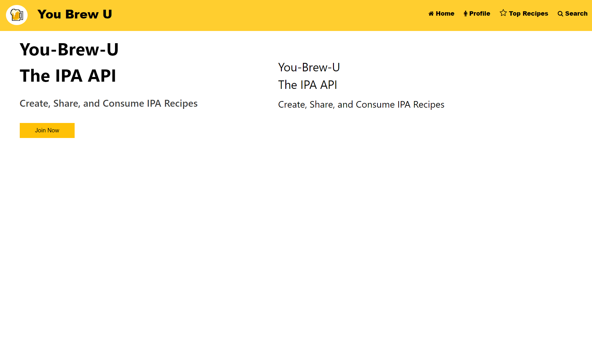

# You Brew U
Home Brewing University for Drunkards

## Overview
This is a web blog for home beer brewers. Users can create an account and post their own favorite recipes for others to see. Users will also have the ability to post a photo of their brew. Future development may include the ability for users to add comments/upbrews (upvotes) on other users' posts. 

## Technologies Used
-HTML
-Javascript
-Handlebars
-Node.js and Express.js
-MySQL and the Sequelize ORM
-Cloudinary Image Plugin
-Heroku

## Team Members
Bennett Holgate
Benjamin Stanfield
James VanOsdol
Junghan Seo

## Installation

1. Clone this repository to your computer's desktop.
2. Navigate to the top level directory.
3. Open the index.html file in a browser.

## Usage

## Link to Web App:  https://holgateb.github.io/you-brew-u/